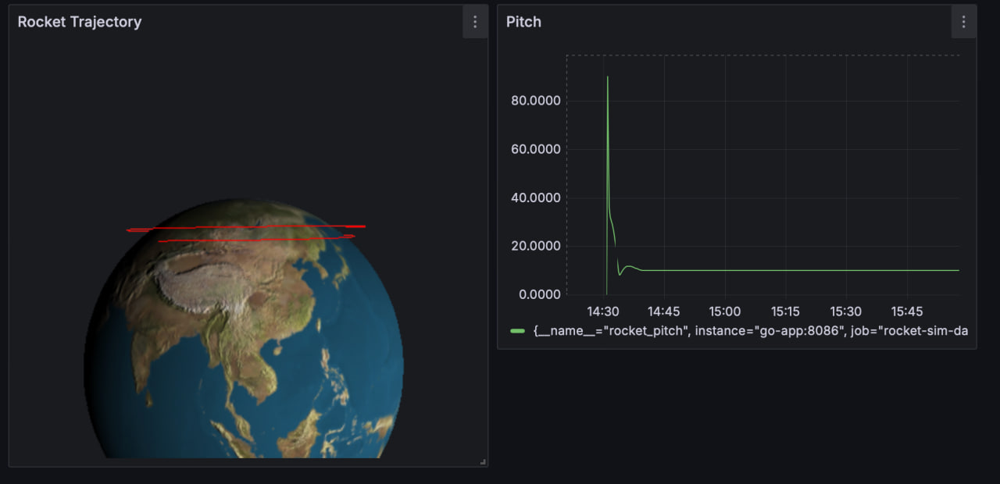
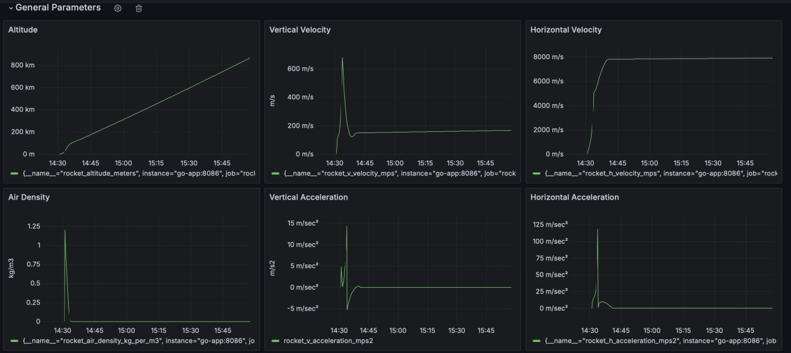
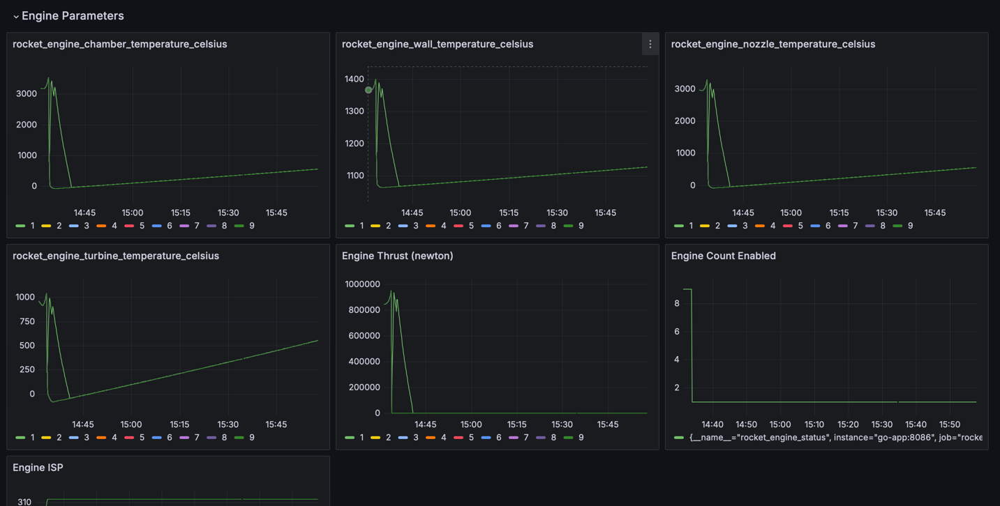

# Rocket Simulator Params

_Version 1.12.2_

This project simulates a rocket flight using approximate parameters inspired by SpaceX's **Falcon 9** architecture. The model takes into account basic physical laws, launch phases, engine configurations, and allows control via a REST API. It is suitable for engineering experiments, flight control algorithm testing, and trajectory visualization.

## Visualization

### 📈 Flight Trajectory

This chart displays the rocket's trajectory over time. It allows you to track ascent phases, orbital insertion, or a failed mission scenario. The model approximates gravity, atmospheric drag, and changing mass during fuel consumption.

---

### ⚙️ Simulation Parameters

This graph presents key parameters such as altitude, velocity, acceleration, and rocket mass over time. It helps analyze the effectiveness of the current configuration and behavior of the model during dynamic conditions.

---

### 🚀 Engine Parameters

This chart shows the state of all active engines, including thrust, fuel consumption rate, and operational status (on/off). It is useful for debugging multi-engine configurations and simulating engine failures.

---

## REST API Endpoints

### 1. Start Simulation
- **Endpoint:** `/simulation/start`
- **Method:** `POST`
- **Description:** Initializes the rocket launch and starts the simulation process. Sending a POST request begins the trajectory and engine calculations.

### 2. Get Simulation Data
- **Endpoint:** `/simulation/data`
- **Method:** `GET`
- **Description:** Retrieves current rocket state data, including altitude, velocity, mass, acceleration, and engine status.

### 3. Get Engines Information
- **Endpoint:** `/engines`
- **Method:** `GET`
- **Description:** Returns a list of all engines, their parameters, and current state.

### 4. Update Engine Information
- **Endpoint:** `/engines/{id}`
- **Method:** `PUT`
- **Description:** Updates parameters for a specific engine by ID. You can modify thrust levels, fuel consumption, or operational mode.

---

## Project Features
- Multi-engine architecture
- Flight stage simulation (ascent, separation, orbit)
- Engine failure support
- Realistic modeling of mass, thrust, and fuel consumption
- REST API for full control and telemetry access

---

_Created with a passion for space and engineering 🚀_
